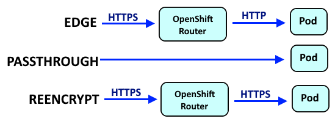

# SAS Viya on AWS ROSA - deployment notes

[TOC]


Local mirror inside SAS network: https://gitlab.sas.com/gtp/viya4-deployments/aws-rosa-validation

Copies of all YAML manifests etc. can be found in the `backup` folder.


## Connect to Jump Host and API server

SSH (Hans)

```shell
ssh -i "/drives/c/Users/gerhje/OneDrive - SAS/Arbeit/ssh_keys/sasviya-ocp-rosa.id" ec2-user@18.221.95.98
```

OCP Web Console (`kubeadmin` / <password from mail>)

```
https://console-openshift-console.apps.rosa.sasviya-5adf.mh2a.p3.openshiftapps.com/
```


## Cluster topology overview

Show label, instance types and local disks

```shell
for node in $(kubectl get nodes -o name); do
  wkclass=$(kubectl get node ${node##*/} -o json | jq -c '.metadata.labels."workload.sas.com/class"')
  instype=$(kubectl get node ${node##*/} -o json | jq -c '.metadata.labels."beta.kubernetes.io/instance-type"')
  printf "%80s\n" " " | tr ' ' '-'
  printf "%-45s %-20s %-20s\n" ${node##*/} ${wkclass} ${instype}
  printf "%80s\n" " " | tr ' ' '-'
  oc debug node/${node##*/} -q -t -- chroot /host lsblk -o NAME,SIZE,FSTYPE,LABEL,MOUNTPOINT
done
```

Output:

```
--------------------------------------------------------------------------------
ip-10-0-0-235.us-east-2.compute.internal      "cas"                "r5d.2xlarge"       
--------------------------------------------------------------------------------
NAME          SIZE FSTYPE LABEL      MOUNTPOINT
nvme0n1       300G                   
|-nvme0n1p1     1M                   
|-nvme0n1p2   127M vfat   EFI-SYSTEM 
|-nvme0n1p3   384M ext4   boot       /boot
`-nvme0n1p4 299.5G xfs    root       /sysroot
nvme1n1     279.4G                   
--------------------------------------------------------------------------------
ip-10-0-0-248.us-east-2.compute.internal      "stateless"          "r5.4xlarge"        
--------------------------------------------------------------------------------
NAME          SIZE FSTYPE LABEL      MOUNTPOINT
nvme0n1       300G                   
|-nvme0n1p1     1M                   
|-nvme0n1p2   127M vfat   EFI-SYSTEM 
|-nvme0n1p3   384M ext4   boot       /boot
`-nvme0n1p4 299.5G xfs    root       /sysroot
nvme1n1       128G ext4              /var/lib/kubelet/pods/f52edd7a-abd2-46cb-a9
--------------------------------------------------------------------------------
ip-10-0-0-250.us-east-2.compute.internal      "stateful"           "r5.2xlarge"        
--------------------------------------------------------------------------------
NAME          SIZE FSTYPE LABEL      MOUNTPOINT
nvme0n1       300G                   
|-nvme0n1p1     1M                   
|-nvme0n1p2   127M vfat   EFI-SYSTEM 
|-nvme0n1p3   384M ext4   boot       /boot
`-nvme0n1p4 299.5G xfs    root       /sysroot
nvme1n1         1G ext4              /var/lib/kubelet/pods/e19300d1-fa20-4ca6-85
nvme2n1         2G ext4              /var/lib/kubelet/pods/cfeee0a7-1cc6-4eb2-9f
nvme3n1         1G ext4              /var/lib/kubelet/pods/a6083d90-ad22-46a3-8a
nvme4n1         1G ext4              /var/lib/kubelet/pods/d5d8e560-1fbd-483c-98
nvme5n1         1G ext4              /var/lib/kubelet/pods/2081e4b3-7edd-47d2-ad
nvme6n1       128G ext4              /var/lib/kubelet/pods/8fca4709-f170-4227-8c
nvme7n1       128G ext4              /var/lib/kubelet/pods/41f9754a-6835-4b35-8b
--------------------------------------------------------------------------------
ip-10-0-0-56.us-east-2.compute.internal       "compute"            "r5d.xlarge"        
--------------------------------------------------------------------------------
NAME          SIZE FSTYPE LABEL      MOUNTPOINT
nvme1n1     139.7G                   
nvme0n1       300G                   
|-nvme0n1p1     1M                   
|-nvme0n1p2   127M vfat   EFI-SYSTEM 
|-nvme0n1p3   384M ext4   boot       /boot
`-nvme0n1p4 299.5G xfs    root       /sysroot
--------------------------------------------------------------------------------
ip-10-0-0-94.us-east-2.compute.internal       null                 "m5.2xlarge"        
--------------------------------------------------------------------------------
...
--------------------------------------------------------------------------------
ip-10-0-0-99.us-east-2.compute.internal       null                 "m5.2xlarge"        
--------------------------------------------------------------------------------
...
```


Show taints

```shell
kubectl get nodes -o='custom-columns=NodeName:.metadata.name,TaintKey:.spec.taints[].key,TaintValue:.spec.taints[].value,TaintEffect:.spec.taints[*].effect'
```

Output:

```
NodeName                                   TaintKey                 TaintValue   TaintEffect
ip-10-0-0-235.us-east-2.compute.internal   workload.sas.com/class   cas          NoSchedule
ip-10-0-0-248.us-east-2.compute.internal   workload.sas.com/class   stateless    NoSchedule
ip-10-0-0-250.us-east-2.compute.internal   workload.sas.com/class   stateful     NoSchedule
ip-10-0-0-56.us-east-2.compute.internal    workload.sas.com/class   compute      NoSchedule
ip-10-0-0-94.us-east-2.compute.internal    <none>                   <none>       <none>
ip-10-0-0-99.us-east-2.compute.internal    <none>                   <none>       <none>
```


## Additional tooling

```shell
# jq and others
sudo yum install -y mlocate vim wget git jq zip unzip tmux

# yq
wget https://github.com/mikefarah/yq/releases/download/v4.42.1/yq_linux_amd64
chmod 755 yq_linux_amd64
sudo mv yq_linux_amd64 /usr/local/bin/yq

# krew (https://krew.sigs.k8s.io/plugins/)
(
  set -x; cd "$(mktemp -d)" &&
  OS="$(uname | tr '[:upper:]' '[:lower:]')" &&
  ARCH="$(uname -m | sed -e 's/x86_64/amd64/' -e 's/\(arm\)\(64\)\?.*/\1\2/' -e 's/aarch64$/arm64/')" &&
  KREW="krew-${OS}_${ARCH}" &&
  curl -fsSLO "https://github.com/kubernetes-sigs/krew/releases/latest/download/${KREW}.tar.gz" &&
  tar zxvf "${KREW}.tar.gz" &&
  ./"${KREW}" install krew
)

echo 'export PATH="${KREW_ROOT:-$HOME/.krew}/bin:$PATH"' >> ~/.bashrc
. ~/.bashrc

# krew: install a few plugins
kubectl krew install split-yaml
kubectl krew install resource-capacity
kubectl krew install lineage
kubectl krew install rbac-lookup
kubectl krew install access-matrix
kubectl krew install unlimited

# krew examples
kubectl lineage deployments sas-logon-app -n viya4
watch kubectl resource-capacity --pods --util --sort cpu.util -n viya4

# SAS Viya Orders CLI
wget https://github.com/sassoftware/viya4-orders-cli/releases/download/1.6.0/viya4-orders-cli_linux_amd64

sudo mv viya4-orders-cli_linux_amd64 /usr/local/bin/sas-viya-orders
sudo chmod 775 /usr/local/bin/sas-viya-orders

sas-viya-orders -v

# SAS Mirror Manager
wget https://support.sas.com/installation/viya/4/sas-mirror-manager/lax/mirrormgr-linux.tgz
tar xvzf mirrormgr-linux.tgz
rm -f mirrormgr-linux.tgz

sudo mv mirrormgr /usr/local/bin/
rm -rf LICENSE README.md esp-edge-extension/ licenses/

mirrormgr -v

# SAS Viya CLI, download from https://support.sas.com/downloads/package.htm?pid=2512
# Copy CLI package to machine
tar xvzf ~/sas-viya-cli-*-linux-amd64.tgz
rm -f ~/sas-viya-cli-*-linux-amd64.tgz
sudo mv sas-viya /usr/local/bin

sas-viya plugins list-repos
sas-viya plugins list-repo-plugins

sas-viya plugins install --repo sas audit
sas-viya plugins install --repo sas authorization
sas-viya plugins install --repo sas batch
sas-viya plugins install --repo sas cas
sas-viya plugins install --repo sas compute
sas-viya plugins install --repo sas configuration
sas-viya plugins install --repo sas credentials
sas-viya plugins install --repo sas dagentsrv
sas-viya plugins install --repo sas dcmtransfer
sas-viya plugins install --repo sas detection
sas-viya plugins install --repo sas detection-definition
sas-viya plugins install --repo sas detection-message-schema
sas-viya plugins install --repo sas decisiongitdeploy   
sas-viya plugins install --repo sas devices
sas-viya plugins install --repo sas folders
sas-viya plugins install --repo sas fonts
sas-viya plugins install --repo sas identities
sas-viya plugins install --repo sas job
sas-viya plugins install --repo sas launcher
sas-viya plugins install --repo sas licenses
sas-viya plugins install --repo sas listdata
sas-viya plugins install --repo sas mip-migration
sas-viya plugins install --repo sas models
sas-viya plugins install --repo sas notifications
sas-viya plugins install --repo sas oauth
sas-viya plugins install --repo sas reports
sas-viya plugins install --repo sas rfc-solution-config
sas-viya plugins install --repo sas rtdmobjectmigration
sas-viya plugins install --repo sas scoreexecution
sas-viya plugins install --repo sas sid-functions
sas-viya plugins install --repo sas transfer
sas-viya plugins install --repo sas workload-orchestrator
sas-viya plugins install --repo sas visual-forecasting
```

Connecting:

```shell
sas-viya profile set-endpoint https://sasviya.apps.rosa.sasviya-5adf.mh2a.p3.openshiftapps.com/
sas-viya profile set-output text
sas-viya profile toggle-color n
sas-viya profile show

sas-viya auth login --user sasadm --password lnxsas
```


## Deploy OpenLDAP server

```shell
oc new-project openldap
oc create sa openldap-sa

oc adm policy add-scc-to-user nonroot -n openldap -z openldap-sa

oc apply -f ~/yaml/openldap-deploy.yaml 
oc get deploy,svc,pods
```

Test query (dumps LDAP database contents)

```shell
kubectl exec -it deploy/viya4-openldap-server --insecure-skip-tls-verify -- ldapsearch -H ldap://viya4-openldap-service.openldap.svc.cluster.local:389 -b "dc=example,dc=org" -x -D "cn=admin,dc=example,dc=org" -w "lnxsas"
```

Accounts:

* sasadm / lnxsas
* demo01 / lnxsas
* demo02 / lnxsas


## Create RWX Storage fileshare and test

Fileshare (`sas-efs-shared-pvc`) used by SAS, requires `viya4` namespace. **Note**: this needs to be in place before the deployment starts.

```shell
kubectl apply -f ~/yaml/create-pvc-shared-data.yaml
oc get pv,pvc

oc apply -f ~/yaml/test-rwx-storage.yaml
# check the log for any errors
oc logs job/rwx-storage-test

kubectl delete -f ~/yaml/create-pvc-shared-data.yaml
```


## SAS Viya deployment

``` shell
oc new-project viya4

mkdir -p ~/viya4/site-config/patches
mkdir -p ~/viya4/site-config/resources
mkdir -p ~/viya4/site-config/security/cacerts

tar xvzf ~/SASViyaV4_*.tgz
```


### Apply Viya security constraints

These steps need to be executed by the cluster-admin. 

```shell
cd ~/viya4

# list all available SCCs
find ./sas-bases -name "*scc*.yaml"

# apply most of them
oc create -f ./sas-bases/examples/cas/configure/cas-server-scc.yaml
oc create -f ./sas-bases/examples/configure-elasticsearch/internal/openshift/sas-opendistro-scc.yaml
oc create -f ./sas-bases/examples/restore/scripts/openshift/sas-backup-pv-copy-cleanup-job-scc.yaml
oc create -f ./sas-bases/examples/sas-connect-spawner/openshift/sas-connect-spawner-scc.yaml
oc create -f ./sas-bases/overlays/migration/openshift/migration-job-scc.yaml
oc create -f ./sas-bases/overlays/sas-microanalytic-score/service-account/sas-microanalytic-score-scc.yaml
oc create -f ./sas-bases/overlays/sas-model-repository/service-account/sas-model-repository-scc.yaml

# confirm
oc get scc
```

*Note: repeat this step if the namespace gets re-created*

```shell
oc project viya4

oc -n viya4 adm policy add-scc-to-user sas-cas-server -z sas-cas-server
oc -n viya4 adm policy add-scc-to-user sas-opendistro -z sas-opendistro
oc -n viya4 adm policy add-scc-to-user sas-connect-spawner -z sas-connect-spawner
oc -n viya4 adm policy add-scc-to-user anyuid -z sas-model-publish-kaniko
oc -n viya4 adm policy add-scc-to-user nonroot -z sas-programming-environment
oc -n viya4 adm policy add-scc-to-user sas-microanalytic-score -z sas-microanalytic-score
oc -n viya4 adm policy add-scc-to-user sas-model-repository -z sas-model-repository
```

List bindings to local service accounts

```shell
kubectl get rolebindings,clusterrolebindings --all-namespaces  \
    -o custom-columns='KIND:kind,NAMESPACE:metadata.namespace,NAME:metadata.name,SERVICE_ACCOUNTS:subjects[?(@.kind=="ServiceAccount")].name' \
    | grep "KIND\|viya4"
```


### Patches


#### Patch fsGroup value

Find the fsgroup value and update the fsGroup within the security context of Pods within the cluster. The fsGroup value is a random value and changes when re-creating the project/namespace. Make sure to use the right name for your namespace.

```shell
FSGROUP=$(oc get project viya4 -o jsonpath='{.metadata.annotations.openshift\.io/sa\.scc\.supplemental-groups}' | cut -f1 -d /)
echo $FSGROUP

cp sas-bases/examples/security/container-security/update-fsgroup.yaml site-config/patches/update-fsgroup.yaml
chmod 644 site-config/patches/update-fsgroup.yaml

sed -i "s|{{ FSGROUP_VALUE }}|$FSGROUP|" site-config/patches/update-fsgroup.yaml

# check
head -n 30 site-config/patches/update-fsgroup.yaml
```


#### Storage patches

Used to provide persistent storage to SAS computation engines (MAS, SAS, CAS)

##### MAS

Based on  `$deploy/sas-bases/examples/sas-microanalytic-score/astores`. Provides the MAS engine with persistent storage for saving ASTORE model files.

```yaml
resources:
(...)
- site-config/patches/mas-astore-pvc.yaml
```

##### CAS

(optional) fileshare for CAS for accessing business data. Requires existing PVC.

```yaml
transformers:
- site-config/patches/cas-nfsshare-mount.yaml
```

##### SAS

(optional) fileshare for SAS compute sessions for accessing business data. Requires existing PVC.

```yaml
transformers:
- site-config/patches/sas-nfsshare-mount.yaml
```


#### TLS - handling web server certificates

There are multiple TLS options for Routes in OpenShift:



SAS Viya by default uses the "edge" termination case and in general assumes that a web server certificate (cert + key) is available for the deployment. The certificate could either be provided by the customer's IT or generated during the deployment using openssl.


##### HAProxy, LetsEncrypt certificate chain

However, this deployment uses the default TLS certificate stored on the Router (HAProxy). This certificate is signed by Let's Encrypt using the following trust chain:

```shell
</dev/null openssl s_client -connect console-openshift-console.apps.rosa.sasviya-5adf.mh2a.p3.openshiftapps.com:443 \
	--showcerts | openssl x509
	
depth=2 C = US, O = Internet Security Research Group, CN = ISRG Root X1
verify return:1
depth=1 C = US, O = Let's Encrypt, CN = R3
verify return:1
depth=0 CN = *.apps.rosa.sasviya-5adf.mh2a.p3.openshiftapps.com
...
```

i.e.:

* C = US, O = Internet Security Research Group, CN = ISRG Root X1
  * C = US, O = Let's Encrypt, CN = R3
    * CN = *.apps.rosa.sasviya-5adf.mh2a.p3.openshiftapps.com

Since we do not have a web server certificate available, we cannot include the patches meant for front-door-tls or full-stack-tls which can be found at `sas-bases/components/security/core/base`. We still want to include the templates found at `sas-bases/components/security/network/route.openshift.io/route` because we do want Routes to be added to the site.yaml. 

As some components in SAS Viya use a "north-south" communication pattern, SAS needs to trust the LE CA and Root certs. We will add these certificates to the pod truststores (this might not be needed actually - the CA's of the LE certificate could already be known and trusted).

```shell
mkdir -p site-config/security/cacerts

curl -s https://letsencrypt.org/certs/lets-encrypt-r3.pem | openssl x509 -text | \
	sed -n '/-----BEGIN/,/-----END/p' > site-config/security/cacerts/le-r3.pem
curl -s https://letsencrypt.org/certs/isrgrootx1.pem | openssl x509 -text | \
	sed -n '/-----BEGIN/,/-----END/p' > site-config/security/cacerts/le-isrgrootx1.pem

# check
openssl x509 -in site-config/security/cacerts/le-r3.pem -text
openssl x509 -in site-config/security/cacerts/le-isrgrootx1.pem -text
```


##### PostgreSQL database server, certificate chain

The connection to the external PostgreSQL database  (RDS) is secured using TLS as well, so this CA and root certificate should be added as well. Like before, the following command shows the certificate chain:

```shell
</dev/null openssl s_client -starttls postgres -connect psql-sasviya-5adf.caimyblnfcv2.us-east-2.rds.amazonaws.com:5432 -showcerts | openssl x509

depth=2 C = US, O = "Amazon Web Services, Inc.", OU = Amazon RDS, ST = WA, CN = Amazon RDS us-east-2 Root CA RSA2048 G1, L = Seattle
verify return:1
depth=1 C = US, O = "Amazon Web Services, Inc.", OU = Amazon RDS, ST = WA, CN = Amazon RDS us-east-2 Subordinate CA RSA2048 G1.A.2, L = Seattle
verify return:1
depth=0 CN = psql-sasviya-5adf.caimyblnfcv2.us-east-2.rds.amazonaws.com, OU = RDS, O = Amazon.com, L = Seattle, ST = Washington, C = US
verify return:1
```

i.e.:

* C = US, O = "Amazon Web Services, Inc.", OU = Amazon RDS, ST = WA, CN = Amazon RDS us-east-2 Root CA RSA2048 G1, L = Seattle
  * C = US, O = "Amazon Web Services, Inc.", OU = Amazon RDS, ST = WA, CN = Amazon RDS us-east-2 Subordinate CA RSA2048 G1.A.2, L = Seattle
    * CN = psql-sasviya-5adf.caimyblnfcv2.us-east-2.rds.amazonaws.com, OU = RDS, O = Amazon.com, L = Seattle, ST = Washington, C = US

To extract the certificates from the output of the openssl command:

```shell
</dev/null openssl s_client -starttls postgres -connect psql-sasviya-5adf.caimyblnfcv2.us-east-2.rds.amazonaws.com:5432 -showcerts 2>&1 | sed -n '/-----BEGIN/,/-----END/p' > ~/viya4/site-config/security/cacerts/rds-certs.pem
```


##### Adding the certificates to the Viya truststores

The patch to add the new certificates to the truststores:

```shell
# add ca-cert to truststore list
cp sas-bases/examples/security/customer-provided-ca-certificates.yaml site-config/security/
chmod 644 site-config/security/customer-provided-ca-certificates.yaml

sed -i "s|{{ CA_CERTIFICATE_FILE_NAME }}|site-config/security/cacerts/le-isrgrootx1.pem|" site-config/security/customer-provided-ca-certificates.yaml
printf "\n- site-config/security/cacerts/le-r3.pem\n" >> site-config/security/customer-provided-ca-certificates.yaml
printf "\n- site-config/security/cacerts/rds-certs.pem\n" >> site-config/security/customer-provided-ca-certificates.yaml
```

We will include `sas-bases/components/security/core/base/truststores-only` in the kustomization.yaml to make kustomize pick up the truststore configuration.


#### Using an external PostgreSQL database

SAS stores its metadata in a PostgreSQL database, which in this case has been set up as a managed RDS service. To connect to the database:

```shell
PGPASSWORD=stJb... psql -h psql-sasviya-5adf.caimyblnfcv2.us-east-2.rds.amazonaws.com -U postgres -d SharedServices
\dt+ *.*
```


#### Using generic ephemeral volumes for SASWORK

This configuration will dynamically attach an EBS disk to the compute node when a SAS compute session is started and removes it when the session terminates.

```shell
cp sas-bases/examples/sas-programming-environment/storage/change-viya-volume-storage-class.yaml site-config/patches/
chmod 644 site-config/patches/change-viya-volume-storage-class.yaml 

gev='ephemeral:
        volumeClaimTemplate:
          metadata:
            labels:
              type: ephemeral-saswork-volume
          spec:
            accessModes: [ "ReadWriteOnce" ]
            storageClassName: "gp3-csi"
            resources:
              requests:
                storage: 64Gi'

awk -i inplace -v x="{{ VOLUME-STORAGE-CLASS }}" -v y="$gev" '{gsub(x,y,$0); print $0}' site-config/patches/change-viya-volume-storage-class.yaml 

cat site-config/patches/change-viya-volume-storage-class.yaml
```


#### Using local storage operator (LSO) for CAS disk cache

We're using "diskfull" instance types for the CAS and the compute nodes. These virtual machines have an additional NVMe data disk, which can be used for CDC.

* r5d.xlarge : 1 x 150 NVMe SSD
* r5d.2xlarge : 1x 300 NVMe SSD

Note that the LSO cannot be easily used for SASWORK, because it will mount a full partition as a single PV. Since each SAS session requires a separate PV, it would only allow a single session on each compute node. A work-around could be to partition the data disk into multiple partitions, which would limit the concurrency of SAS compute sessions to the amount of partitions.

Other options for reconfiguring SASWORK include:

* using emptyDir (default), optionally setting `kubelet_disk_type=temporary`
* using the data disk via `hostPath`
* using EBS-backed generic ephemeral volumes


##### Prepare data disk for CAS node

Find the right (data) disk to use for the LSO.

```shell
# check which disk is not mounted
CASNODE=ip-10-0-0-235.us-east-2.compute.internal
oc debug node/$CASNODE -q -t -- chroot /host lsblk -o NAME,SIZE,FSTYPE,LABEL,MOUNTPOINT

# NAME          SIZE FSTYPE LABEL      MOUNTPOINT
# nvme0n1       300G                   
# ├─nvme0n1p1     1M                   
# ├─nvme0n1p2   127M vfat   EFI-SYSTEM 
# ├─nvme0n1p3   384M ext4   boot       /boot
# └─nvme0n1p4 299.5G xfs    root       /sysroot
# nvme1n1     279.4G
```


##### Configure LocalVolume

Next, install the Local Storage Operator from the Operator Hub and define the LocalVolume for CDC.

```shell
kubectl apply -f ~/yaml/create-nvme-localvolume-cas.yaml

# check
kubectl get LocalVolume --all-namespaces -o wide

oc get sc | grep sastmp
oc get pv | grep local

oc get all -n openshift-local-storage
```


##### SAS configuration

The CAS service account is not allowed to use ephemeral storage, so this needs to be added to the SCC:

```shell
# check ("ephemeral" is missing)
oc get scc sas-cas-server -o jsonpath='{.volumes}'
oc get scc sas-cas-server -o json | jq '.volumes += ["ephemeral"]' | oc apply -f -
```

Add the transformer patch to kustomization.yaml and redeploy. Then restart the CAS server:

```yaml
oc -n viya4  delete pods -l app.kubernetes.io/managed-by=sas-cas-operator
```

Check in SAS Studio:

```shell
cas sess1;

proc cas;
    session sess1;
    accessControl.assumeRole / adminRole="superuser";
    builtins.getCacheInfo result=results;
    print results.diskCacheInfo;
run;
quit;

cas sess1 clear;
```

Output:

```
Node	File System	Capacity	Free_Mem	%_Used	NodePath
controller.sas-cas-server-default.viya4.svc.cluster.local	/dev/nvme1n1	279 GB	276 GB	2.0	/cas/cache-sastmp
```


## Build & deploy

### Simple deploy

```shell
cd ~/viya4
kustomize build -o site.yaml

oc project viya4
kubectl apply --selector="sas.com/admin=cluster-api" --server-side --force-conflicts -f site.yaml
kubectl apply --selector="sas.com/admin=cluster-wide" -f site.yaml
kubectl apply --selector="sas.com/admin=cluster-local" -f site.yaml --prune
kubectl apply --selector="sas.com/admin=namespace" -f site.yaml --prune
```


### Redeploy when the namespace has been deleted

```shell
oc new-project viya4

# the SCC definitions are still in place, but the bindings might be lost
oc -n viya4 adm policy add-scc-to-user sas-cas-server -z sas-cas-server
oc -n viya4 adm policy add-scc-to-user sas-opendistro -z sas-opendistro
oc -n viya4 adm policy add-scc-to-user sas-connect-spawner -z sas-connect-spawner
oc -n viya4 adm policy add-scc-to-user anyuid -z sas-model-publish-kaniko
oc -n viya4 adm policy add-scc-to-user nonroot -z sas-programming-environment
oc -n viya4 adm policy add-scc-to-user sas-microanalytic-score -z sas-microanalytic-score
oc -n viya4 adm policy add-scc-to-user sas-model-repository -z sas-model-repository

cd ~/viya4

# recreate the shared-data PVC
kubectl apply -f ~/yaml/create-pvc-shared-data.yaml

# the fsgroup value has changed
FSGROUP=$(oc get project viya4 -o jsonpath='{.metadata.annotations.openshift\.io/sa\.scc\.supplemental-groups}' | cut -f1 -d /)
cp sas-bases/examples/security/container-security/update-fsgroup.yaml site-config/patches/update-fsgroup.yaml
chmod 644 site-config/patches/update-fsgroup.yaml
sed -i "s|{{ FSGROUP_VALUE }}|$FSGROUP|" site-config/patches/update-fsgroup.yaml

# rebuild and submit
kustomize build -o site.yaml

kubectl apply --selector="sas.com/admin=cluster-api" --server-side --force-conflicts -f site.yaml
kubectl apply --selector="sas.com/admin=cluster-wide" -f site.yaml
kubectl apply --selector="sas.com/admin=cluster-local" -f site.yaml --prune
kubectl apply --selector="sas.com/admin=namespace" -f site.yaml --prune
```


### Split site.yaml

(optional, useful for submitting selected manifests only)

```shell
cd ~/viya4
rm -rf splityaml/
cat ~/viya4/site.yaml | kubectl split-yaml -p splityaml/
cd splityaml/
```


## Start and Stop

```shell
kubectl create job sas-stop-all-`date +%s` --from cronjobs/sas-stop-all -n viya4
kubectl create job sas-start-all-`date +%s` --from cronjobs/sas-start-all -n viya4
```

