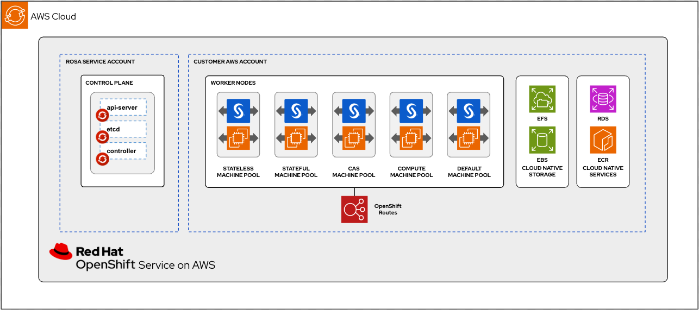

# SAS Viya and Red Hat OpenShift Service on AWS (ROSA)

## Introduction

This Git repository is a companion to the blog [SAS Viya on Red Hat OpenShift Service for AWS (ROSA)](https://www.redhat.com/en/blog/sas-viya-on-red-hat-openshift-service-for-aws-rosa) published on the Red Hat blog web site. The contents of this blog document the joint effort of SAS and Red Hat to validate a deployment of SAS Viya on the Red Hat OpenShift service on AWS. We've used the 2024.02 STABLE release of SAS Viya for this validation deployment.

Here's a reference diagram showing the ROSA infrastructure with SAS Viya installed:

## [ROSA Deployment](https://github.com/redhat-gpst/sas-viya-rosa/tree/main/rosa) 

## [SAS Viya Deployment](https://github.com/redhat-gpst/sas-viya-rosa/tree/main/sas-configuration)

## License

This project is licensed under the [Apache 2.0 License](https://github.com/sassoftware/sas-studio-custom-steps/blob/main/LICENSE).

## Additional Resources

* [https://www.redhat.com/en/technologies/cloud-computing/openshift/aws](https://www.redhat.com/en/technologies/cloud-computing/openshift/aws) - to find more information about ROSA. 

* [https://www.sas.com/en_us/software/viya.html](https://www.sas.com/en_us/software/viya.html) - for more information about SAS Viya.
* [SAS Viya Operations Guide](https://go.documentation.sas.com/doc/en/itopscdc/v_049/itopswlcm/home.htm)
* Two-part blog with technical information about SAS Viya on OpenShift:
  * https://www.redhat.com/en/blog/sas-viya-on-red-hat-openshift-part-1-reference-architecture-and-deployment-considerations
  * https://www.redhat.com/en/blog/sas-viya-on-red-hat-openshift-part-2-security-and-storage-considerations

